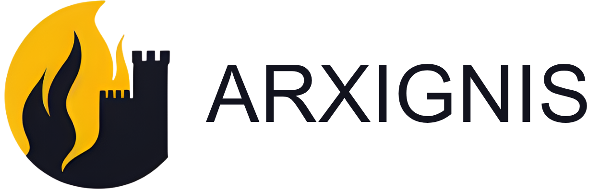

<p align="center">
  <a href="https://github.com/arxignis/moat/blob/main/LICENSE"></a> &nbsp;
  <a href="https://github.com/arxignis/moat/actions?query=branch%3Amain"></a> &nbsp;
  <a href="https://github.com/arxignis/moat/releases"></a> &nbsp;
   &nbsp;
  <a href="https://docs.arxignis.com/"></a> &nbsp;
  <a href="https://discord.gg/jzsW5Q6s9q"></a> &nbsp;
  <a href="https://x.com/arxignis"> </a>
</p>

# Community
[](https://discord.gg/jzsW5Q6s9q)
[](https://arxignis.substack.com/)


## Moat Operator (Go)

This Go operator watches Moat configuration ConfigMaps and keeps the running pods in sync by forcing a rollout any time the config content changes. It relies on the same Helm labels as the upstream `moat-main/helm` chart (`app.kubernetes.io/name=moat`) so it naturally plugs into Helm releases of Moat.

### How It Works
- Reconciles only `ConfigMap` objects labelled with `app.kubernetes.io/name=moat`.
- Hashes the combined `data` and `binaryData` payload of the ConfigMap.
- Patches every Moat `Deployment` in the same namespace (matching the same label) with the hash stored under `moat.arxignis.com/config-hash` in the pod template annotations.
- Updating the annotation bumps the ReplicaSet template hash, causing Kubernetes to roll the pods and pick up the new configuration.

### Project Layout
- `main.go` bootstraps a controller-runtime manager with health probes and optional namespace scoping.
- `controllers/configmap_controller.go` contains the reconciliation logic and hashing helper.
- `config/` holds a kustomize deployment (service account, RBAC, manager deployment). Replace `ghcr.io/example/moat-operator:latest` with your published image.

### Building
```bash
GOOS=linux GOARCH=amd64 go build -o bin/moat-operator
```
Adjust the target architecture if you are building for another platform.

To containerize:
```bash
docker build -t ghcr.io/<org>/moat-operator:latest .
docker push ghcr.io/<org>/moat-operator:latest
```
Update `config/manager.yaml` with the pushed image reference.

### Deploying with Kustomize
```bash
kubectl apply -k config
```
This creates the `moat-system` namespace, service account, RBAC, and a single replica of the operator.

### Testing From WSL (no commands executed yet)
1. **Prepare tools** – ensure WSL has `docker`, `kubectl`, and `kind` (or `minikube`) installed and on `$PATH`.
2. **Build & load the image** – inside WSL build the Linux image and use `kind load docker-image ghcr.io/<org>/moat-operator:latest` (or push to a registry reachable by your cluster).
3. **Create a test cluster** – `kind create cluster --name moat`.
4. **Deploy Moat via Helm** – from `moat-main/helm`, run `helm install moat ./helm --namespace moat --create-namespace`. This produces the ConfigMap and Deployment with the expected labels.
5. **Apply the operator manifests** – `kubectl apply -k ../moat-operator/config`.
6. **Trigger a config change** – edit the Moat ConfigMap (`kubectl edit configmap moat -n moat`) or use `kubectl patch`.
7. **Verify restart** – watch the Deployment rollout: `kubectl rollout status deployment/moat -n moat` and ensure pod annotation `moat.arxignis.com/config-hash` updates.

### Helm Integration Notes
The Helm chart already labels both the ConfigMap and Deployment with `app.kubernetes.io/name=moat`. The operator leans on those labels to discover which objects belong together. When Helm updates the ConfigMap (e.g., via `helm upgrade`), the operator sees the new data, recalculates the hash, and patches the Deployment so the change propagates without any manual restarts.

