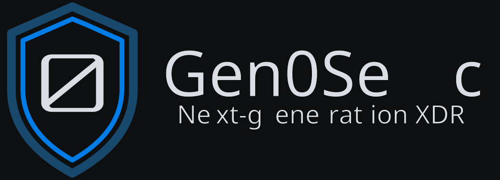
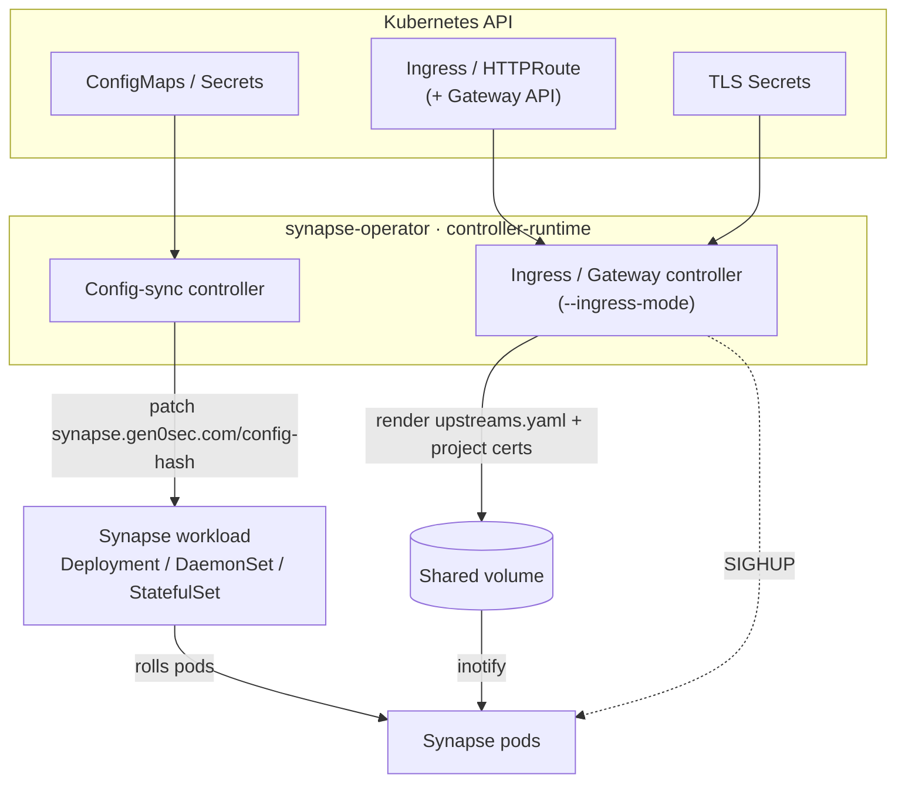

<p align="center">
  
</p>

<p align="center">
  <a href="https://github.com/gen0sec/synapse-operator/blob/main/LICENSE"></a> &nbsp;
  <a href="https://github.com/gen0sec/synapse-operator/releases"></a> &nbsp;
   &nbsp;
  <a href="https://docs.gen0sec.com/"></a> &nbsp;
  <a href="https://discord.gg/jzsW5Q6s9q"></a> &nbsp;
  <a href="https://x.com/gen0sec"></a>
</p>

<p align="center">
  <a href="https://discord.gg/jzsW5Q6s9q"></a>
  <a href="https://gen0sec.substack.com/"></a>
</p>

---

## Keep Synapse in Sync on Kubernetes

A Go [controller-runtime](https://github.com/kubernetes-sigs/controller-runtime) operator for running [Synapse](https://github.com/gen0sec/synapse) on Kubernetes. It runs in **two modes** from the same binary: a **config-sync controller** that rolls Synapse pods when their config changes, and an **Ingress + Gateway API controller** that renders native Kubernetes routing into Synapse's upstreams.

**What it does:**
- **Config-sync (default)** — hashes every ConfigMap/Secret matching a label selector and stamps the hash onto the Synapse workload, so Kubernetes rolls the pods whenever config content changes (no manual restarts)
- **Ingress / Gateway API mode** (`--ingress-mode`) — reconciles class-matched `Ingress` and Gateway API `HTTPRoute` objects into Synapse's `upstreams.yaml` on a shared volume, hot-reloaded via inotify + `SIGHUP`
- **TLS projection** — projects referenced Ingress/Gateway TLS Secrets into Synapse's certificates directory, operator-owned and hot-reloaded
- **Status & HA** — optionally publishes load-balancer addresses on matched Ingresses and gates shared status writes behind a Lease when running more than one proxy replica
- **Helm-native** — keys off `app.kubernetes.io/name=synapse`, so it plugs straight into Synapse Helm releases

> **Go 1.24+** · any conformant **Kubernetes** cluster · Gateway API CRDs required only for `--gateway-api`

---

## Quick start

### Build

```bash
GOOS=linux GOARCH=amd64 go build -o bin/synapse-operator
```

### Container

```bash
docker build -t ghcr.io/<org>/synapse-operator:latest .
docker push  ghcr.io/<org>/synapse-operator:latest
```

Update `config/manager.yaml` with the pushed image reference.

### Deploy with Kustomize

```bash
kubectl apply -k config
```

Creates the `synapse-system` namespace, ServiceAccount, RBAC, and a single operator replica.

### Deploy with Helm (alongside Synapse)

```bash
helm repo add gen0sec https://helm.gen0sec.com
helm repo update

export GEN0SEC_API_KEY="REPLACE_ME"
helm upgrade --install synapse-stack gen0sec/synapse-stack \
  -n synapse --create-namespace \
  --set global.namespaces.synapse="synapse" \
  --set global.namespaces.operator="synapse-system" \
  --set synapse.image.repository="ghcr.io/gen0sec/synapse" \
  --set synapse.image.tag="latest" \
  --set synapse.synapse.gen0sec.apiKey="$GEN0SEC_API_KEY" \
  --set operator.enabled=true \
  --set operator.image.repository="ghcr.io/<org>/synapse-operator" \
  --set operator.image.tag="latest"
```

Verify, then trigger a config change and watch the rollout:

```bash
kubectl -n synapse-system rollout status deployment/synapse-operator
kubectl -n synapse edit configmap synapse-stack          # change any key
kubectl -n synapse rollout status deployment/synapse-stack
# the pod annotation synapse.gen0sec.com/config-hash updates
```

---

## Modes

The operator runs as **one** of two controllers per process, selected by `--ingress-mode`. Both share the same manager, health probes, and optional namespace scoping.

> **Config-sync** is the default — it never touches routing, it only forces rollouts when watched config changes.
>
> **Ingress / Gateway API** turns native Kubernetes routing objects into Synapse's `upstreams.yaml` and keeps Synapse hot-reloaded in place.

| | Config-sync | Ingress / Gateway API |
|---|:---:|:---:|
| Flag | _(default)_ | `--ingress-mode` |
| Watches | ConfigMaps + Secrets (by label) | `Ingress` (+ `HTTPRoute` with `--gateway-api`) |
| Action | stamp config hash → roll workload | render `upstreams.yaml` → inotify + `SIGHUP` |
| TLS Secret projection | — | ✅ via `--certs-out` |
| Publishes LB status on Ingress | — | ✅ via `--publish-status-address` |
| One-shot initContainer prime | — | ✅ `--render-once` |
| Multi-replica shared-status HA | — | ✅ `--status-leader-election` |

---

## Architecture


```mermaid
flowchart TD
    subgraph K8s[Kubernetes API]
        CM[ConfigMaps / Secrets]
        ING["Ingress / HTTPRoute<br/>(+ Gateway API)"]
        TLS[TLS Secrets]
    end

    subgraph OP[synapse-operator · controller-runtime]
        direction TB
        C1[Config-sync controller]
        C2["Ingress / Gateway controller<br/>(--ingress-mode)"]
    end

    CM --> C1
    ING --> C2
    TLS --> C2

    C1 -->|patch synapse.gen0sec.com/config-hash| WL[Synapse workload<br/>Deployment / DaemonSet / StatefulSet]
    WL -->|rolls pods| SYN[Synapse pods]
    C2 -->|render upstreams.yaml + project certs| SHV[(Shared volume)]
    SHV -->|inotify| SYN
    C2 -.SIGHUP.-> SYN
```

---

## Configuration flags

**Common**

| Flag | Default | Purpose |
|---|---|---|
| `--metrics-bind-address` | `:8080` | Metrics endpoint address |
| `--health-probe-bind-address` | `:8081` | Health probe address |
| `--leader-elect` | `false` | Leader election for the controller manager |
| `--namespace` | _(all)_ | Restrict the watch to one namespace |

**Config-sync mode**

| Flag | Default | Purpose |
|---|---|---|
| `--label-selector` | `app.kubernetes.io/name=synapse` | Selects config sources and workloads |
| `--config-hash-annotation` | `synapse.gen0sec.com/config-hash` | Annotation key for the hash |
| `--ignore-configmap-keys` | `upstreams.yaml` | Comma-separated ConfigMap keys excluded from the hash |
| `--ignore-secret-keys` | _(none)_ | Comma-separated Secret keys excluded from the hash |

**Ingress / Gateway API mode** (`--ingress-mode`)

| Flag | Default | Purpose |
|---|---|---|
| `--render-once` | `false` | One-shot: render `upstreams.yaml` and exit (initContainer prime) |
| `--ingress-class` | `synapse` | `spec.ingressClassName` this controller serves |
| `--upstreams-out` | `/shared/upstreams.yaml` | Path of the rendered upstreams file |
| `--cluster-domain` | `cluster.local` | Cluster DNS domain for backend FQDNs |
| `--certs-out` | _(disabled)_ | Directory to project referenced TLS Secrets into |
| `--gateway-api` | `false` | Also reconcile Gateway API (requires the CRDs) |
| `--publish-status-address` | _(none)_ | IPs/hostnames to publish on matched Ingresses' status |
| `--reload-process-name` | `synapse` | argv0 of the co-located proxy to `SIGHUP` |
| `--status-leader-election` | `false` | Only the Lease holder writes shared status (>1 replica) |
| `--status-leader-election-id` | `synapse-ingress-status` | Lease name for the shared-status election |
| `--leader-election-namespace` | `$POD_NAMESPACE` | Namespace for the shared-status Lease |

---

## Documentation

| | |
|---|---|
| [Gen0Sec Docs](https://docs.gen0sec.com/) | Product documentation and guides |
| [Synapse](https://github.com/gen0sec/synapse) | The NDR/proxy this operator manages |
| [`config/`](config/) | Kustomize deployment: namespace, ServiceAccount, RBAC, manager |
| [`SECURITY.md`](SECURITY.md) | Security policy and disclosure |

---

## Thank you!

- [Kubernetes SIGs](https://github.com/kubernetes-sigs/controller-runtime) for controller-runtime
- [Kubernetes Gateway API](https://github.com/kubernetes-sigs/gateway-api) for the Gateway API
