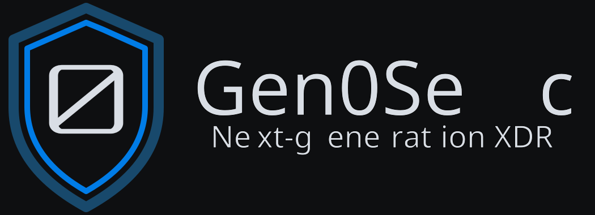
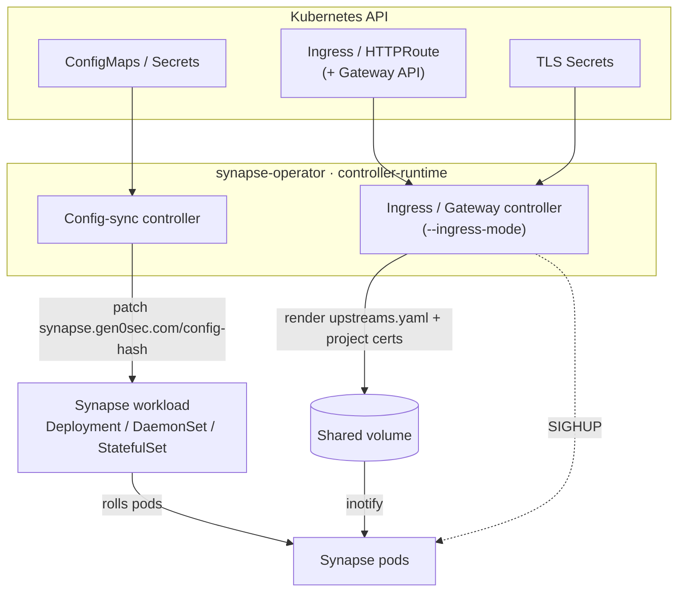

<p align="center">
  
</p>

<p align="center">
  <a href="https://github.com/gen0sec/synapse-operator/blob/main/LICENSE"></a> &nbsp;
  <a href="https://github.com/gen0sec/synapse-operator/releases"></a> &nbsp;
   &nbsp;
  <a href="https://docs.gen0sec.com/"></a> &nbsp;
  <a href="https://discord.gg/jzsW5Q6s9q"></a> &nbsp;
  <a href="https://x.com/gen0sec"></a>
</p>

<p align="center">
  <a href="https://discord.gg/jzsW5Q6s9q"></a>
  <a href="https://gen0sec.substack.com/"></a>
</p>

---

## Keep Synapse in Sync on Kubernetes

A Go [controller-runtime](https://github.com/kubernetes-sigs/controller-runtime) operator for running [Synapse](https://github.com/gen0sec/synapse) on Kubernetes. It runs in **two modes** from the same binary: a **config-sync controller** that rolls Synapse pods when their config changes, and an **Ingress + Gateway API controller** that renders native Kubernetes routing into Synapse's upstreams.

**What it does:**
- **Config-sync (default)** — hashes every ConfigMap/Secret matching a label selector and stamps the hash onto the Synapse workload, so Kubernetes rolls the pods whenever config content changes (no manual restarts)
- **Ingress / Gateway API mode** (`--ingress-mode`) — reconciles class-matched `Ingress` and Gateway API `HTTPRoute` objects into Synapse's `upstreams.yaml` on a shared volume, hot-reloaded via inotify + `SIGHUP`
- **TLS projection** — projects referenced Ingress/Gateway TLS Secrets into Synapse's certificates directory, operator-owned and hot-reloaded
- **Status & HA** — optionally publishes load-balancer addresses on matched Ingresses and gates shared status writes behind a Lease when running more than one proxy replica
- **Helm-native** — keys off `app.kubernetes.io/name=synapse`, so it plugs straight into Synapse Helm releases

> **Go 1.26+** · any conformant **Kubernetes** cluster · Gateway API CRDs required only for `--gateway-api`

---

## Quick start

### Build

```bash
GOOS=linux GOARCH=amd64 go build -o bin/synapse-operator
```

### Test

```bash
make test               # every package
make verify-generated   # fails if the CRDs or deepcopy code are stale
```

The API tests run against a local Kubernetes API server. Its binaries are downloaded on first use; set `KUBEBUILDER_ASSETS` to use ones already on disk.

After changing a type under `api/`, run `make generate manifests` and commit the result.

### Container

```bash
docker build -t ghcr.io/<org>/synapse-operator:latest .
docker push  ghcr.io/<org>/synapse-operator:latest
```

Update `config/manager.yaml` with the pushed image reference.

### Deploy with Kustomize

```bash
kubectl apply -k config
```

Creates the `synapse-os` namespace, ServiceAccount, RBAC, and a single operator replica.

### Deploy with Helm (alongside Synapse)

```bash
helm repo add gen0sec https://helm.gen0sec.com
helm repo update

export GEN0SEC_API_KEY="REPLACE_ME"
helm upgrade --install synapse-stack gen0sec/synapse-stack \
  -n synapse --create-namespace \
  --set global.namespaces.synapse="synapse" \
  --set global.namespaces.operator="synapse-os" \
  --set synapse.image.repository="ghcr.io/gen0sec/synapse" \
  --set synapse.image.tag="latest" \
  --set synapse.synapse.gen0sec.apiKey="$GEN0SEC_API_KEY" \
  --set operator.enabled=true \
  --set operator.image.repository="ghcr.io/<org>/synapse-operator" \
  --set operator.image.tag="latest"
```

Verify, then trigger a config change and watch the rollout:

```bash
kubectl -n synapse-os rollout status deployment/synapse-operator
kubectl -n synapse edit configmap synapse-stack          # change any key
kubectl -n synapse rollout status deployment/synapse-stack
# the pod annotation synapse.gen0sec.com/config-hash updates
```

---

## Modes

The operator runs as **one** of three controllers per process, selected by `--ingress-mode` or `--config-sync`. All share the same manager, health probes, and optional namespace scoping.

> **Config-sync** is the default — it never touches routing, it only forces rollouts when watched config changes.
>
> **Ingress / Gateway API** turns native Kubernetes routing objects into Synapse's `upstreams.yaml` and keeps Synapse hot-reloaded in place.

| | Config-sync | Ingress / Gateway API |
|---|:---:|:---:|
| Flag | _(default)_ | `--ingress-mode` |
| Watches | ConfigMaps + Secrets (by label) | `Ingress` (+ `HTTPRoute` with `--gateway-api`) |
| Action | stamp config hash → roll workload | render `upstreams.yaml` → inotify + `SIGHUP` |
| TLS Secret projection | — | ✅ via `--certs-out` |
| Publishes LB status on Ingress | — | ✅ via `--publish-status-address` |
| One-shot initContainer prime | — | ✅ `--render-once` |
| Multi-replica shared-status HA | — | ✅ `--status-leader-election` |

### Path matching

In `--ingress-mode`, each Ingress/HTTPRoute path is rendered into a Synapse route by path type:

| Source | Rendered as |
|---|---|
| Ingress `Prefix` · Gateway `PathPrefix` | Synapse longest-prefix path (key = the path) |
| Ingress `Exact` · Gateway `Exact` | Approximated as a prefix (Synapse matches longest-prefix) + a warning event |
| Ingress `ImplementationSpecific` + `nginx.ingress.kubernetes.io/use-regex: "true"` | Regex route — `match_expr: http.request.path matches "<regex>"` |
| Gateway `RegularExpression` | Regex route — `match_expr: http.request.path matches "<regex>"` |
| `/.well-known/acme-challenge/*` | `internal_paths` (cert-manager HTTP-01 solver) |

Regex paths are **anchored at the start** (`^`) since they match from the beginning of the request path (the Kubernetes Ingress spec also requires the stored path to begin with `/`, so the leading `^` is supplied by the renderer). The path-map key for a regex route is a unique label; matching is driven entirely by `match_expr`. Header / method / query-param match conditions are not representable in Synapse's host+path model and are dropped with a warning event.

---

## Architecture


```mermaid
flowchart TD
    subgraph K8s[Kubernetes API]
        CM[ConfigMaps / Secrets]
        ING["Ingress / HTTPRoute<br/>(+ Gateway API)"]
        TLS[TLS Secrets]
    end

    subgraph OP[synapse-operator · controller-runtime]
        direction TB
        C1[Config-sync controller]
        C2["Ingress / Gateway controller<br/>(--ingress-mode)"]
    end

    CM --> C1
    ING --> C2
    TLS --> C2

    C1 -->|patch synapse.gen0sec.com/config-hash| WL[Synapse workload<br/>Deployment / DaemonSet / StatefulSet]
    WL -->|rolls pods| SYN[Synapse pods]
    C2 -->|render upstreams.yaml + project certs| SHV[(Shared volume)]
    SHV -->|inotify| SYN
    C2 -.SIGHUP.-> SYN
```

---

## Configuration flags

**Common**

| Flag | Default | Purpose |
|---|---|---|
| `--metrics-bind-address` | `:8080` | Metrics endpoint address |
| `--health-probe-bind-address` | `:8081` | Health probe address |
| `--leader-elect` | `false` | Leader election for the controller manager |
| `--namespace` | _(all)_ | Restrict the watch to one namespace |

**Config-sync mode**

| Flag | Default | Purpose |
|---|---|---|
| `--label-selector` | `app.kubernetes.io/name=synapse` | Selects config sources and workloads. Objects controlled by one of the operator's own resources (`synapse.gen0sec.com`) are left alone even when they match: the controller for that resource rolls them |
| `--config-hash-annotation` | `synapse.gen0sec.com/config-hash` | Annotation key for the hash |
| `--ignore-configmap-keys` | `upstreams.yaml` | Comma-separated ConfigMap keys excluded from the hash |
| `--ignore-secret-keys` | _(none)_ | Comma-separated Secret keys excluded from the hash |

**Ingress / Gateway API mode** (`--ingress-mode`)

| Flag | Default | Purpose |
|---|---|---|
| `--render-once` | `false` | One-shot: render `upstreams.yaml` and exit (initContainer prime) |
| `--ingress-class` | `synapse` | `spec.ingressClassName` this controller serves |
| `--upstreams-out` | `/shared/upstreams.yaml` | Path of the rendered upstreams file (sidecar layout) |
| `--upstreams-out-configmap` | _(none)_ | Central layout: write the rendered `upstreams.yaml` to this ConfigMap (`namespace/name`) instead of a file. Only the `upstreams.yaml` key is updated; other keys are preserved. Synapse reloads from its ConfigMap mount. |
| `--resolve-backend-cluster-ips` | `false` | Emit `<clusterIP>:port` instead of `<svc>.<ns>.svc.<cluster-domain>:port`, so Synapse skips backend DNS (falls back to the FQDN for headless / ExternalName / unallocated Services) |
| `--cluster-domain` | `cluster.local` | Cluster DNS domain for backend FQDNs |
| `--certs-out` | _(disabled)_ | Directory to project referenced TLS Secrets into |
| `--gateway-api` | `false` | Also reconcile Gateway API (requires the CRDs) |
| `--publish-status-address` | _(none)_ | IPs/hostnames to publish on matched Ingresses' status |
| `--reload-process-name` | `synapse` | argv0 of the co-located proxy to `SIGHUP` |
| `--status-leader-election` | `false` | Only the Lease holder writes shared status (>1 replica) |
| `--status-leader-election-id` | `synapse-ingress-status` | Lease name for the shared-status election |
| `--leader-election-namespace` | `$POD_NAMESPACE` | Namespace for the shared-status Lease |

**Config-sync mode** (`--config-sync`) — the thin reload sidecar

| Flag | Default | Purpose |
|---|---|---|
| `--watch-configmap` | _(required)_ | ConfigMap to project, as `namespace/name`. Repeatable. |
| `--out-dir` | `/shared` | Directory to project ConfigMap keys into (the volume shared with synapse) |
| `--sync-keys` | _(all)_ | Comma-separated data keys to project |
| `--sync-once` | `false` | One-shot: project once, guarantee `--ensure-files`, exit (initContainer) |
| `--ensure-files` | `upstreams.yaml` | Filenames that must exist in `--out-dir` before synapse starts |
| `--reload-process-name` | `synapse` | argv0 of the co-located proxy to `SIGHUP` |
| `--reload-debounce` | `500ms` | Coalesce SIGHUP bursts |

### Why this mode exists

A ConfigMap *mount* is not a real-time delivery mechanism. kubelet re-projects a mounted ConfigMap on its own sync loop, so the delay scales with the kubelet's `syncFrequency`, which defaults to **1m**. In central mode nothing signals the proxy either: `SignalReload` is disabled whenever `--upstreams-out-configmap` is set, and `upstreams.yaml` sits in `--ignore-configmap-keys` so the config-hash controller deliberately does not roll the pods. Delivery depends entirely on kubelet propagation.

Config-sync reads the ConfigMap **through the API** instead, collapsing that to a single watch event:

```
ConfigMap write -> watch event -> write <out-dir>/<key> -> SIGHUP
```

which lands well inside a second. Synapse is untouched — it still just reads a file and reloads.

Measured on a single-node k3s cluster: Ingress created → proxy actually serving the route, at both the default `syncFrequency` and a tuned-down one.

**`syncFrequency: 1m` (kubelet default), n=5**

| | min | median | max |
|---|---|---|---|
| ConfigMap mount | 55.151s | **69.600s** | 75.497s |
| config-sync sidecar | 0.159s | **0.190s** | 0.254s |

**`syncFrequency: 10s` (tuned), n=10**

| | min | median | max |
|---|---|---|---|
| ConfigMap mount | 2.555s | **6.572s** | 8.573s |
| config-sync sidecar | 0.157s | **0.189s** | 0.270s |

The mounted path tracks `syncFrequency` — a 6x shorter sync loop bought a 10.6x lower median — while the sidecar is **flat at ~0.19s** across both. That is the point: the sidecar does not shorten the kubelet leg, it removes it. It reads the ConfigMap through the API and writes to an `emptyDir`, which kubelet never re-projects.

The median worst case exceeds `syncFrequency` itself (75.5s against a 60s loop) because the total is the remaining sync interval plus jitter, the remount, and synapse's own 500ms settle debounce.

Isolating the kubelet leg alone — ConfigMap write until the file changes inside the pod — the sidecar lands in **7–9ms**.

### Deployment requirements

- **`shareProcessNamespace: true`** on the pod, so the sidecar can see the synapse PID.
- **`runAsUser: 0`** on the sidecar container. The operator image is distroless nonroot (`USER 65532`) while synapse runs as root, so `syscall.Kill` returns `EPERM` without it.
- **`appArmorProfile: {type: Unconfined}`** on the sidecar, on any AppArmor-enforcing host (most Ubuntu/Debian installs). uid parity is *not* sufficient: the sidecar runs under containerd's default AppArmor profile, which only permits signalling peers in the same profile, while a privileged synapse is unconfined. The kernel then denies the signal regardless of uid or `CAP_KILL`:
  ```
  apparmor="DENIED" operation="signal" profile="cri-containerd.apparmor.d" signal=hup peer="unconfined"
  ```
  Failure here is degraded rather than fatal — synapse still picks the file up via its own inotify watch, just after the 500ms settle debounce instead of immediately.
- **A `--sync-once` initContainer.** Not optional: synapse-proxy does a blocking initial read of its upstreams file and, if that read fails, aborts its whole background service *without ever establishing a file watch* — so a pod that starts before the file exists stays deaf to every later update rather than recovering.
- **Metrics/health binds disabled** (the mode forces `0` unless overridden). synapse binds `:8080` for health in the same pod netns, which collides with the operator's metrics default.
- **RBAC**: `configmaps: get,list,watch` in the namespace. It cannot be narrowed to a single ConfigMap — `resourceNames` is ignored for `list`/`watch`, which a watch-based informer requires.

A missing source ConfigMap is **not** an error and never prunes files: leaving the last-good `upstreams.yaml` in place degrades to stale routing, whereas truncating it takes every route down at once.

### Migrating an existing deployment

Nothing changes on the operator side. Central mode keeps rendering into the
same ConfigMap, so the sidecar is purely additive on the proxy pod — you can
migrate one workload at a time, and the old mounted path stays valid
throughout, which is what makes rollback trivial.

The two capabilities are independent switches. `--config-sync` changes how
config is *delivered*; `--resolve-backend-endpoints` changes how backends are
*addressed*. Adopt either alone.

**Phase 0 — upgrade synapse first.** Take a build with the atomic reload
publication fix before anything else. It is a no-op at today's reload rate
and needs no config change, but the later phases raise the reload rate, and
the older clear-then-repopulate applier has a window where a concurrent
lookup misses and the request 502s. Order matters here.

**Phase 1 — delivery (`--config-sync`).** A pod-spec change, so it takes a
rollout. Start from `examples/config-sync-values.yaml` in the synapse-stack
chart; the moving parts are:

| | |
|---|---|
| `proxy.shareProcessNamespace` | `true`, so the sidecar can see the synapse PID |
| `proxy.volumes` / `volumeMounts` | a `shared` `emptyDir` mounted at `/shared` in both containers |
| `proxy.initContainers` | operator with `--config-sync --sync-once --ensure-files=upstreams.yaml` |
| `proxy.extraContainers` | the long-running sidecar, `runAsUser: 0` **and** `appArmorProfile: Unconfined` |
| `proxy.configSync.rbac.create` | `true` — `configmaps: get,list,watch` in the namespace |
| `proxy.synapse.config` | point `proxy.upstream.conf` at `/shared/upstreams.yaml` |

Leave the ConfigMap projection in place. Once `conf` points at `/shared` the
mounted `upstreams.yaml` is inert, but keeping it means reverting is a values
change rather than a re-plumb.

Verify: the sidecar logs `SIGHUP → reload` (not a permission error), synapse
logs `Loading upstreams configuration from: /shared/upstreams.yaml`, and an
Ingress edit is served in well under a second.

**Phase 2 — addressing (`--resolve-backend-endpoints`).** Operator-side flag
plus the `endpointslices` RBAC rule. Verify the rendered `upstreams.yaml`
flips from one `<svc>.<ns>.svc.<domain>:<servicePort>` entry to a sorted list
of `<podIP>:<targetPort>`. **Check the port**: pods listen on `targetPort`,
so a Service of `80 → targetPort 8080` must render `:8080`. If it renders
`:80`, the mapping is wrong and every request fails.

Roll back either phase independently by reverting the values; the ConfigMap
is maintained the whole time.

**Things that bite:**

- The `--sync-once` initContainer is **not optional**. synapse does a
  blocking initial read of its upstreams file and, if that read fails, aborts
  its background service without ever establishing a file watch — a pod that
  starts before the file exists stays deaf to every later update rather than
  recovering.
- `appArmorProfile: Unconfined` is required on any AppArmor-enforcing host.
  uid parity alone is not enough; see **Deployment requirements** above. The
  `appArmorProfile` field needs Kubernetes 1.30+, otherwise use the
  `container.apparmor.security.beta.kubernetes.io/<container>: unconfined`
  annotation.
- RBAC cannot be narrowed to a single ConfigMap — `resourceNames` is ignored
  for `list`/`watch`, which a watch-based informer requires. If read on every
  ConfigMap in the namespace is unacceptable, put the rendered ConfigMap in a
  namespace of its own.
- Don't let the sidecar bind a port synapse already uses; it defaults its
  metrics and health binds to off for this reason.
- `config.yaml` still arrives via the ConfigMap mount. That is deliberate —
  most of it is restart-only and a change there rolls the pod anyway, and a
  fresh pod is populated at mount time rather than on the sync loop. Add it to
  `--sync-keys` if you want it delivered the same way.

### Endpoint-backed upstreams

`--resolve-backend-endpoints` (ingress-mode) renders the **ready pod IPs** from EndpointSlices as the server list, instead of a single Service address.

Without it the renderer emits a Service FQDN and synapse resolves it through its in-process DNS cache, which pins the **first A record only**, is configured once at startup, and does not evict on a failed re-resolve — so a replaced pod can keep receiving traffic long after it is gone. Pod IPs are literals, so synapse never resolves them at all, and a pod change re-renders immediately.

Details that matter:

- The port comes from the **EndpointSlice**, not the Service. Pods listen on `targetPort`; pairing a pod IP with the Service port fails on every request.
- All slices for a Service are unioned (by the `kubernetes.io/service-name` label) and the result is **sorted** — API ordering is unstable, and an unsorted list would make every reconcile look like a change.
- `Ready == nil` counts as ready (the API contract for unknown readiness); only an explicit `false` excludes, as does `Terminating`.
- Dual-stack renders IPv4 when any IPv4 endpoint exists, otherwise IPv6. Unioning both would enter each pod twice.
- An empty result **falls back** to ClusterIP/FQDN rather than rendering an empty server list, which would be a 502 for every request to that host.
- Requires `discovery.k8s.io/endpointslices: get,list,watch`. The watch is only registered when the flag is set.

---

## Documentation

| | |
|---|---|
| [Gen0Sec Docs](https://docs.gen0sec.com/) | Product documentation and guides |
| [Synapse](https://github.com/gen0sec/synapse) | The NDR/proxy this operator manages |
| [`config/`](config/) | Kustomize deployment: namespace, ServiceAccount, RBAC, manager |
| [`SECURITY.md`](SECURITY.md) | Security policy and disclosure |

---

## Thank you!

- [Kubernetes SIGs](https://github.com/kubernetes-sigs/controller-runtime) for controller-runtime
- [Kubernetes Gateway API](https://github.com/kubernetes-sigs/gateway-api) for the Gateway API
